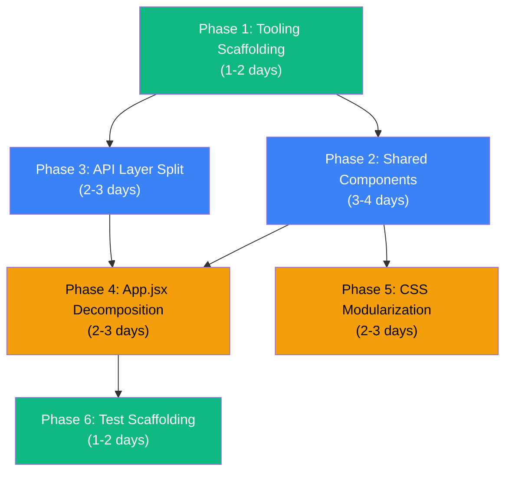

# Converter Output Frontend — Standardization Implementation Plan

## Scope Clarification

This plan modifies the **Python code generator** (`converter/app/generators/react/`) so that the **React applications it outputs** meet production-grade standards. We are NOT modifying the wizard UI — we are changing what the converter *emits*.

---

## Current Generated Output Audit

Examining a real generated output ([`b00b4996/frontend/`](file:///c:/Users/Afzal/ZCodeProject/converter/outputs/b00b4996/frontend)):

```
frontend/
├── index.html                          (301 bytes — no meta description, no SEO)
├── package.json                        (381 bytes — no lint/test/format scripts)
├── vite.config.js                      (298 bytes)
└── src/
    ├── App.jsx                         (39 KB / 322 lines — monolithic)
    ├── main.jsx                        (253 bytes)
    ├── index.css                       (6.6 KB — single global stylesheet)
    ├── pages/                          (97 files — flat, no grouping)
    │   ├── PeopleListPage.jsx          (minified to 14 lines!)
    │   ├── PeopleDetailFormPage.jsx    (253 lines — raw HTML)
    │   ├── DashboardPage.jsx
    │   ├── ReportsPage.jsx
    │   └── ... (93 more files)
    └── services/
        ├── api.js                      (92 KB! — all CRUD for every entity)
        └── mockData.js                 (31 KB)
```

### Specific Gaps Mapped to Analysis Findings

| Analysis Finding | Current Generator Output | Gap |
|---|---|---|
| React component-based development ✗ | Pages use raw `<div className="form-group"><input>` instead of shared components | Every page re-implements form fields, tables, buttons inline |
| Reusable components ✗ | No `components/` directory emitted at all | No Button, Card, FormField, DataTable, Modal, LoadingSpinner |
| Clear separation of concerns ✗ | [`App.jsx`](file:///c:/Users/Afzal/ZCodeProject/converter/outputs/b00b4996/frontend/src/App.jsx) (322 lines) mixes routing, navigation, dashboard, record counts, imports | All 97 page imports + all routes + nav bar + dashboard logic in one file |
| ESLint / Prettier ✗ | [`package.json`](file:///c:/Users/Afzal/ZCodeProject/converter/outputs/b00b4996/frontend/package.json) has no linting deps or scripts | Generator's [`_generate_package_json()`](file:///c:/Users/Afzal/ZCodeProject/converter/app/generators/react/generator.py#L1222-L1243) only emits `dev`/`build`/`preview` |
| Automated testing ✗ | No test files, no test framework | Generator emits zero test files |
| Centralized API client ✗ | Single [`api.js`](file:///c:/Users/Afzal/ZCodeProject/converter/outputs/b00b4996/frontend/src/services/api.js) is 92 KB with repeated `fetch()` per entity | [`_generate_api_client()`](file:///c:/Users/Afzal/ZCodeProject/converter/app/generators/react/generator.py#L953-L1147) repeats identical CRUD 5x per table |
| API error handling ✗ | Each generated function has its own `try/catch` with `console.warn` | No interceptors, no centralized error normalization |
| CSS organization ✗ | Single `index.css` — grows with every form (dynamic styles appended) | [`_generate_index_css()`](file:///c:/Users/Afzal/ZCodeProject/converter/app/generators/react/generator.py#L1280-L1510) appends per-form CSS blocks |
| Consistent naming ✗ | Some pages minified to single lines, others properly formatted | Theme output inconsistency (operations_workspace minifies, legacy formats) |
| Accessibility ✗ | No ARIA labels, no roles, no keyboard navigation | Raw `<button>`, `<input>` without accessible patterns |
| Project documentation ✗ | No README generated | No `_generate_readme()` method exists |

---

## Open Questions

1. **Axios vs Fetch**: The analysis recommends Axios. Should the generated `apiClient.js` use Axios (adds ~15KB bundled dependency to output app) or an enhanced fetch wrapper? Both are viable — Axios gives interceptors and request cancellation natively; fetch keeps the output dependency-free. 
Answer- Strictly implement axios

2. **Generated Test Depth**: Should we generate:
   - (a) **Scaffold only** — `vitest.config.js` + empty test structure + example test (lowest effort)
   - (b) **Smoke tests** — one render test per generated page verifying it mounts without error
   - (c) **Full CRUD tests** — tests for API calls, form submissions, navigation (highest effort)
   Answer - Full CRUD tests

3. **CSS Modules vs Global CSS**: Should generated components use CSS Modules (`.module.css` — scoped, zero runtime cost) or keep global CSS with BEM conventions? CSS Modules require the generated JSX to use `import styles from './Component.module.css'` syntax.
Answer - Use CSS Modules as the standard styling strategy for all newly generated React components and pages. Generate a dedicated .module.css file alongside each component/page where component-specific styling is required, and import it using import styles from "./Component.module.css". Keep only application-wide concerns such as CSS reset, global variables, typography foundations, and truly global utilities in global CSS. Do not use global CSS + BEM as the default strategy for generated components.

4. **TypeScript in Generated Output**: Should the generator start emitting `.tsx`/`.ts` files now (significant generator changes) or remain on `.jsx`/`.js` for this phase?
Answer - Keep generated frontend code in JavaScript/JSX for the current phase. Do not migrate the generator to TypeScript/TSX yet. The repository assessment identifies TypeScript as a future, incremental migration priority, while the immediate focus should be architecture, reusable components, testing, linting/formatting, API standardization, and CSS organization. However, structure the generator/templates so a future language: "typescript" option can introduce .tsx/.ts generation without redesigning the generator architecture.

Do not perform a broad rewrite. Implement these changes incrementally while preserving the existing Access-to-React conversion pipeline and functionality.

---

## Proposed Changes

### Phase 1 — Generated Tooling & Boilerplate
*Modify the generator so every output app ships with linting, formatting, and test infrastructure.*
*Estimated effort: 1–2 days*

---

#### [MODIFY] [`generator.py`](file:///c:/Users/Afzal/ZCodeProject/converter/app/generators/react/generator.py) — `_generate_package_json()` (lines 1222–1243)

Current output:
```json
{
  "scripts": { "dev": "vite", "build": "vite build", "preview": "vite preview" },
  "dependencies": { "react": "19.2.8", "react-dom": "19.2.8", "react-router-dom": "7.18.2" },
  "devDependencies": { "@vitejs/plugin-react": "6.0.5", "vite": "8.2.1" }
}
```

Updated output:
```json
{
  "scripts": {
    "dev": "vite",
    "build": "vite build",
    "preview": "vite preview",
    "lint": "eslint src/ --ext .js,.jsx",
    "lint:fix": "eslint src/ --ext .js,.jsx --fix",
    "format": "prettier --write \"src/**/*.{js,jsx,css,json}\"",
    "format:check": "prettier --check \"src/**/*.{js,jsx,css,json}\"",
    "test": "vitest",
    "test:run": "vitest run"
  },
  "dependencies": {
    "react": "19.2.8",
    "react-dom": "19.2.8",
    "react-router-dom": "7.18.2"
  },
  "devDependencies": {
    "@vitejs/plugin-react": "6.0.5",
    "vite": "8.2.1",
    "eslint": "^9.x",
    "eslint-plugin-react": "^7.x",
    "eslint-plugin-react-hooks": "^5.x",
    "eslint-plugin-jsx-a11y": "^6.x",
    "prettier": "^3.x",
    "eslint-config-prettier": "^10.x",
    "vitest": "^3.x",
    "@testing-library/react": "^16.x",
    "@testing-library/jest-dom": "^6.x",
    "jsdom": "^26.x"
  }
}
```

#### [MODIFY] [`generator.py`](file:///c:/Users/Afzal/ZCodeProject/converter/app/generators/react/generator.py) — `generate()` method (lines 71–191)

Add new file generation calls:

```python
# In generate() method, add after existing file generation:
files[str(output_dir / ".eslintrc.cjs")] = self._generate_eslintrc()
files[str(output_dir / ".prettierrc")] = self._generate_prettierrc()
files[str(output_dir / "vitest.config.js")] = self._generate_vitest_config()
files[str(output_dir / "README.md")] = self._generate_readme()
files[str(src / "test" / "setup.js")] = self._generate_test_setup()
```

#### [MODIFY] [`generator.py`](file:///c:/Users/Afzal/ZCodeProject/converter/app/generators/react/generator.py) — New methods

Add 5 new private methods:
- `_generate_eslintrc()` → ESLint config with React, hooks, a11y, import plugins
- `_generate_prettierrc()` → Prettier config (single quotes, trailing commas, 100 char width)
- `_generate_vitest_config_file()` → Vitest config with jsdom environment
- `_generate_test_setup()` → Test setup file with jest-dom matchers
- `_generate_readme()` → README with architecture overview, scripts, API docs

#### [MODIFY] [`generator.py`](file:///c:/Users/Afzal/ZCodeProject/converter/app/generators/react/generator.py) — `_generate_index_html()` (lines 1264–1278)

Add SEO meta tags:
```diff
 <head>
     <meta charset="UTF-8">
     <meta name="viewport" content="width=device-width, initial-scale=1.0">
+    <meta name="description" content="{self.app_name} — modernized from MS Access">
+    <link rel="preconnect" href="https://fonts.googleapis.com">
+    <link href="https://fonts.googleapis.com/css2?family=Inter:wght@400;500;600;700&display=swap" rel="stylesheet">
     <title>{self.app_name}</title>
 </head>
```

---

### Phase 2 — Shared Component Library Generation
*Generate a `src/components/common/` directory with reusable UI primitives that all pages import.*
*Estimated effort: 3–4 days*

This is the highest-impact change. Currently, every generated page re-implements `<div className="form-group"><label>...<input>...</div>` inline. After this phase, pages will use `<FormField>`, `<Button>`, `<DataTable>`, etc.

---

#### [NEW] `converter/app/generators/react/components_generator.py`

New Python module that generates reusable React components. Each method returns a `dict[str, str]` of file path → content.

**Components to generate:**

| Component | What it replaces | Used by |
|-----------|-----------------|---------|
| `Button.jsx` + `Button.module.css` | Raw `<button className="btn">`, `<button className="btn btn-secondary">` | Every form page, reports page |
| `FormField.jsx` + `FormField.module.css` | Repeated `<div className="form-group"><label><input>` pattern | Every FormPage (50+ files) |
| `DataTable.jsx` + `DataTable.module.css` | Repeated `<table className="data-table"><thead><tbody>` pattern | Every ListPage (40+ files) |
| `LoadingSpinner.jsx` | Inline `<div className="loading">Loading...</div>` | Every page with data fetching |
| `ErrorMessage.jsx` | Inline `<div className="error">{error}</div>` | Every page with error state |
| `EmptyState.jsx` | Nothing (currently shows blank) | List pages with no records |
| `PageHeader.jsx` + `PageHeader.module.css` | Repeated `<h1>` + description + action button pattern | Every page |
| `Card.jsx` + `Card.module.css` | Raw `<div>` wrappers for dashboard widgets | Dashboard pages |
| `InfoField.jsx` | Repeated `<div className="info-field"><span className="info-label">` | Detail/read-only pages |
| `ErrorBoundary.jsx` | Nothing (no error boundaries exist) | App.jsx wraps entire app |
| `index.js` | N/A | Barrel export for all components |

Example — `FormField.jsx` generation:
```python
def _generate_form_field_component(self) -> str:
    return """import React from 'react';
import styles from './FormField.module.css';

export default function FormField({
    label, name, type = 'text', value, onChange,
    required = false, disabled = false, options = [],
    placeholder = '', error = '', rows = 4,
}) {
    const id = `field-${name}`;

    if (type === 'checkbox') {
        return (
            <div className={styles.formGroup}>
                <label className={styles.checkboxLabel}>
                    <input type="checkbox" name={name} checked={!!value}
                        onChange={onChange} disabled={disabled} />
                    {label}
                </label>
            </div>
        );
    }

    if (type === 'select') {
        return (
            <div className={styles.formGroup}>
                <label htmlFor={id} className={styles.label}>{label}{required && ' *'}</label>
                <select id={id} name={name} value={value || ''}
                    onChange={onChange} disabled={disabled} className={styles.select}>
                    <option value="">Select...</option>
                    {options.map(opt => (
                        <option key={opt.value} value={opt.value}>{opt.label}</option>
                    ))}
                </select>
                {error && <span className={styles.error}>{error}</span>}
            </div>
        );
    }

    if (type === 'textarea') {
        return (
            <div className={styles.formGroup}>
                <label htmlFor={id} className={styles.label}>{label}{required && ' *'}</label>
                <textarea id={id} name={name} value={value || ''} onChange={onChange}
                    disabled={disabled} rows={rows} placeholder={placeholder}
                    className={styles.textarea} />
                {error && <span className={styles.error}>{error}</span>}
            </div>
        );
    }

    return (
        <div className={styles.formGroup}>
            <label htmlFor={id} className={styles.label}>{label}{required && ' *'}</label>
            <input type={type} id={id} name={name} value={value || ''}
                onChange={onChange} required={required} disabled={disabled}
                placeholder={placeholder} className={styles.input}
                aria-describedby={error ? `${id}-error` : undefined} />
            {error && <span id={`${id}-error`} className={styles.error} role="alert">{error}</span>}
        </div>
    );
}
"""
```

#### [MODIFY] [`generator.py`](file:///c:/Users/Afzal/ZCodeProject/converter/app/generators/react/generator.py) — `generate()` method

Call the new components generator:

```python
from .components_generator import ComponentsGenerator

# In generate():
comp_gen = ComponentsGenerator()
files.update(comp_gen.generate(src / "components" / "common"))
```

#### [MODIFY] [`generator.py`](file:///c:/Users/Afzal/ZCodeProject/converter/app/generators/react/generator.py) — `_generate_form_page()` (lines 602–737)

Update the legacy form page generator to import and use `FormField` instead of raw HTML:

```diff
- import React, {{ useState, useEffect }} from 'react';
+ import React, {{ useState, useEffect }} from 'react';
+ import FormField from '../components/common/FormField';
+ import Button from '../components/common/Button';
+ import PageHeader from '../components/common/PageHeader';
+ import LoadingSpinner from '../components/common/LoadingSpinner';
+ import ErrorMessage from '../components/common/ErrorMessage';
```

Form field generation changes from:
```python
# Current (lines 651-661):
form_fields.append(f"""
    <div className="form-group">
        <label htmlFor="{field_name}">{label}</label>
        <input type="{input_type}" id="{field_name}" name="{field_name}"
            value={{formData.{field_name} || ''}} onChange={{handleChange}} />
    </div>""")
```

To:
```python
# New:
form_fields.append(f"""
    <FormField label="{label}" name="{field_name}" type="{input_type}"
        value={{formData.{field_name}}} onChange={{handleChange}} />""")
```

#### [MODIFY] [`generator.py`](file:///c:/Users/Afzal/ZCodeProject/converter/app/generators/react/generator.py) — `_generate_list_page()` (lines 529–600)

Update to use `DataTable`, `PageHeader`, `LoadingSpinner`, `EmptyState` components.

#### [MODIFY] [`generator.py`](file:///c:/Users/Afzal/ZCodeProject/converter/app/generators/react/generator.py) — `_generate_unbound_page()` (lines 341–454)

Update to use `FormField`, `Button`, `PageHeader` components.

#### [MODIFY] All theme files

Each theme's `render_*` methods must also use the shared components:

| Theme File | Methods to Update |
|---|---|
| [`classic.py`](file:///c:/Users/Afzal/ZCodeProject/converter/app/generators/react/themes/classic.py) | `render_list_page`, `render_form_page`, `render_dashboard_page`, `render_detail_page`, `render_master_detail_page` |
| [`modern_dashboard.py`](file:///c:/Users/Afzal/ZCodeProject/converter/app/generators/react/themes/modern_dashboard.py) | Same set |
| [`material.py`](file:///c:/Users/Afzal/ZCodeProject/converter/app/generators/react/themes/material.py) | Same set |
| [`exact.py`](file:///c:/Users/Afzal/ZCodeProject/converter/app/generators/react/themes/exact.py) | Same set (may keep raw HTML for pixel-perfect layout) |
| [`operations_workspace.py`](file:///c:/Users/Afzal/ZCodeProject/converter/app/generators/react/themes/operations_workspace.py) | Same set |

#### [MODIFY] [`base.py`](file:///c:/Users/Afzal/ZCodeProject/converter/app/generators/react/themes/base.py) — `_build_form_fields_jsx()` (line 146+)

Update the shared form-field builder in the base theme to emit `<FormField>` component usage instead of raw `<div className="form-group">`.

---

### Phase 3 — API Layer Restructure
*Split the monolithic 92KB api.js into a centralized client + per-domain service files.*
*Estimated effort: 2–3 days*

---

#### [MODIFY] [`generator.py`](file:///c:/Users/Afzal/ZCodeProject/converter/app/generators/react/generator.py) — `_generate_api_client()` (lines 953–1147)

Replace the single method that generates one massive `api.js` with three new methods:

##### `_generate_api_base_client()` → `src/services/apiClient.js`

Centralized HTTP client with:
- Configurable `baseURL` from environment
- Request/response interceptors for auth token injection
- Centralized error handling and normalization
- Request timeout configuration

```python
def _generate_api_base_client(self) -> str:
    return """const API_BASE = import.meta.env.VITE_API_BASE || '/api';

class ApiClient {
    async request(endpoint, options = {}) {
        const url = `${API_BASE}${endpoint}`;
        const config = {
            headers: { 'Content-Type': 'application/json', ...options.headers },
            ...options,
        };

        try {
            const response = await fetch(url, config);
            if (!response.ok) {
                const error = await response.json().catch(() => ({ message: response.statusText }));
                throw new ApiError(error.message || 'Request failed', response.status);
            }
            if (response.status === 204) return null;
            const text = await response.text();
            return text ? JSON.parse(text) : null;
        } catch (err) {
            if (err instanceof ApiError) throw err;
            throw new ApiError(err.message || 'Network error', 0);
        }
    }

    get(endpoint) { return this.request(endpoint); }
    post(endpoint, data) { return this.request(endpoint, { method: 'POST', body: JSON.stringify(data) }); }
    put(endpoint, data) { return this.request(endpoint, { method: 'PUT', body: JSON.stringify(data) }); }
    delete(endpoint) { return this.request(endpoint, { method: 'DELETE' }); }
}

export class ApiError extends Error {
    constructor(message, status) { super(message); this.status = status; this.name = 'ApiError'; }
}

export default new ApiClient();
"""
```

##### `_generate_entity_service(table)` → `src/services/{entityName}Service.js`

One service file per entity (instead of all CRUD in one file):

```python
def _generate_entity_service(self, table) -> str:
    entity = self._to_pascal(table.name)
    endpoint = self._to_kebab(table.name)
    has_mock = hasattr(self, '_mock_data') and entity in (self._mock_data or {})
    mock_import = f"import {{ mock{entity} }} from './mockData';\n" if has_mock else ""
    mock_fallback = f"mock{entity}" if has_mock else "[]"

    return f"""{mock_import}import api from './apiClient';

const ENDPOINT = '/{endpoint}';

export async function getAll() {{
    try {{ return await api.get(ENDPOINT); }}
    catch (err) {{ console.warn('[{entity}] Using fallback data:', err.message); return [...{mock_fallback}]; }}
}}

export async function getById(id) {{
    try {{ return await api.get(`${{ENDPOINT}}/${{id}}`); }}
    catch (err) {{ console.warn('[{entity}] Using fallback data:', err.message); return {mock_fallback}.find(i => String(i.id) === String(id)); }}
}}

export async function create(data) {{ return api.post(ENDPOINT, data); }}
export async function update(id, data) {{ return api.put(`${{ENDPOINT}}/${{id}}`, data); }}
export async function remove(id) {{ return api.delete(`${{ENDPOINT}}/${{id}}`); }}
"""
```

##### `_generate_report_service()` → `src/services/reportService.js`

Extract the report-specific API functions currently mixed into api.js (lines 1082–1137).

#### [MODIFY] [`generator.py`](file:///c:/Users/Afzal/ZCodeProject/converter/app/generators/react/generator.py) — `generate()` method

Replace single `api.js` emission with:
```python
# Replace:
#   files[str(src / "services" / "api.js")] = self._generate_api_client()
# With:
files[str(src / "services" / "apiClient.js")] = self._generate_api_base_client()
for table in self.app.tables:
    if table.role not in ("SYSTEM", "INTERNAL"):
        entity = self._to_pascal(table.name)
        files[str(src / "services" / f"{entity}Service.js")] = self._generate_entity_service(table)
if self._reports:
    files[str(src / "services" / "reportService.js")] = self._generate_report_service()
```

#### [MODIFY] All page generators and themes

Update import statements in generated pages from:
```python
f"import {{ get{api_name}, get{api_name}ById, create{api_name}, update{api_name} }} from '../services/api';"
```
To:
```python
f"import {{ getAll, getById, create, update }} from '../services/{api_name}Service';"
```

---

### Phase 4 — Architecture: App.jsx Decomposition
*Break the monolithic App.jsx into proper layout, routing, and hooks.*
*Estimated effort: 2–3 days*

The generated [`App.jsx`](file:///c:/Users/Afzal/ZCodeProject/converter/outputs/b00b4996/frontend/src/App.jsx) is 322 lines with 97 imports. It must be decomposed.

---

#### [MODIFY] [`generator.py`](file:///c:/Users/Afzal/ZCodeProject/converter/app/generators/react/generator.py) — `_generate_app_jsx()` and `_generate_themed_app_jsx()`

Split into three generated files:

##### Generated `src/App.jsx` (simplified to ~15 lines)
```jsx
import React from 'react';
import { BrowserRouter as Router } from 'react-router-dom';
import AppLayout from './components/layout/AppLayout';
import AppRouter from './routes/AppRouter';
import ErrorBoundary from './components/common/ErrorBoundary';

export default function App() {
    return (
        <ErrorBoundary>
            <Router>
                <AppLayout>
                    <AppRouter />
                </AppLayout>
            </Router>
        </ErrorBoundary>
    );
}
```

##### Generated `src/routes/AppRouter.jsx`

All `<Routes>` / `<Route>` definitions extracted here. For the b00b4996 sample, this moves 97 imports + 150 route lines out of App.jsx.

##### Generated `src/components/layout/AppLayout.jsx`

Navigation bar / sidebar / shell extracted here. Theme-specific — each theme generates its own layout component:
- Classic → top nav bar
- Modern Dashboard → sidebar + top bar
- Material → app bar + drawer
- Operations Workspace → grouped sidebar + record rail

#### [MODIFY] All theme files — `render_app_shell()`

Each theme's `render_app_shell()` currently returns a single monolithic `App.jsx` string. Update to return three separate strings (or a dict) for `App.jsx`, `AppRouter.jsx`, and `AppLayout.jsx`.

#### [NEW] Generated `src/hooks/useApi.js`

Custom hook for data fetching with loading/error state:
```jsx
export function useApi(fetchFn, deps = []) {
    const [data, setData] = useState(null);
    const [loading, setLoading] = useState(true);
    const [error, setError] = useState(null);
    // ... useEffect, cleanup, refetch
    return { data, loading, error, refetch };
}
```

This replaces the identical `useState` + `useEffect` + `try/catch/finally` pattern repeated in every single generated list page and form page.

---

### Phase 5 — CSS Modularization
*Break the monolithic index.css into design tokens + component-level styles.*
*Estimated effort: 2–3 days*

---

#### [MODIFY] [`generator.py`](file:///c:/Users/Afzal/ZCodeProject/converter/app/generators/react/generator.py) — `_generate_index_css()` (lines 1280–1510)

Split into:

| Generated File | Contents |
|---|---|
| `src/styles/tokens.css` | CSS custom properties (`:root` block — colors, shadows, radii, fonts) |
| `src/styles/reset.css` | Global reset (`* { box-sizing }`, body font, base element styles) |
| `src/index.css` | Two `@import` lines only: `@import './styles/tokens.css'; @import './styles/reset.css';` |
| Component `.module.css` files | Co-located with each shared component (generated in Phase 2) |

Remove the dynamic per-form CSS blocks (lines 1475–1510) that currently append form-specific color hues. Instead, generate page-level CSS modules where needed.

#### [MODIFY] All theme files — `get_css()`

Each theme's `get_css()` method currently returns a single massive CSS string. Update to return a `dict[str, str]` mapping file paths to CSS content, with component-level separation.

---

### Phase 6 — Generated Test Scaffolding
*Generate basic test files that verify pages render and API calls work.*
*Estimated effort: 1–2 days*

---

#### [MODIFY] [`generator.py`](file:///c:/Users/Afzal/ZCodeProject/converter/app/generators/react/generator.py) — `generate()` method

Add test file generation:

```python
# Generate test files
files[str(src / "services" / "__tests__" / "apiClient.test.js")] = self._generate_api_client_test()

for table in self.app.tables:
    if table.role not in ("SYSTEM", "INTERNAL"):
        entity = self._to_pascal(table.name)
        files[str(src / "pages" / "__tests__" / f"{entity}Page.test.jsx")] = (
            self._generate_page_smoke_test(entity)
        )
```

##### Generated `apiClient.test.js`
Tests that:
- GET/POST/PUT/DELETE methods call correct URLs
- Error responses throw `ApiError` with status
- Network errors are handled gracefully

##### Generated `{Entity}Page.test.jsx` (per entity)
Smoke test that verifies:
- Component renders without crashing
- Loading state appears initially
- Error state renders when API fails

Example:
```jsx
import { render, screen } from '@testing-library/react';
import { BrowserRouter } from 'react-router-dom';
import PeopleListPage from '../PeopleListPage';

test('PeopleListPage renders loading state', () => {
    render(<BrowserRouter><PeopleListPage /></BrowserRouter>);
    expect(screen.getByText(/loading/i)).toBeInTheDocument();
});
```

---

## Files Modified Summary

### Generator Core

| File | Action | What Changes |
|---|---|---|
| [`generator.py`](file:///c:/Users/Afzal/ZCodeProject/converter/app/generators/react/generator.py) | MODIFY | `generate()`, `_generate_package_json()`, `_generate_api_client()` → split, `_generate_app_jsx()` → decompose, `_generate_index_css()` → split, `_generate_index_html()`, `_generate_form_page()`, `_generate_list_page()`, `_generate_unbound_page()` — use shared components. Add ~10 new `_generate_*()` methods |

### New Module

| File | Action | What Changes |
|---|---|---|
| `converter/app/generators/react/components_generator.py` | NEW | Generates all `src/components/common/*` files |

### Theme Files

| File | Action | What Changes |
|---|---|---|
| [`base.py`](file:///c:/Users/Afzal/ZCodeProject/converter/app/generators/react/themes/base.py) | MODIFY | `_build_form_fields_jsx()` → use `<FormField>`, `render_app_shell()` signature update |
| [`classic.py`](file:///c:/Users/Afzal/ZCodeProject/converter/app/generators/react/themes/classic.py) | MODIFY | All `render_*` methods → use shared components, `get_css()` → return split CSS, `render_app_shell()` → return decomposed App/Router/Layout |
| [`modern_dashboard.py`](file:///c:/Users/Afzal/ZCodeProject/converter/app/generators/react/themes/modern_dashboard.py) | MODIFY | Same as classic |
| [`material.py`](file:///c:/Users/Afzal/ZCodeProject/converter/app/generators/react/themes/material.py) | MODIFY | Same as classic |
| [`exact.py`](file:///c:/Users/Afzal/ZCodeProject/converter/app/generators/react/themes/exact.py) | MODIFY | Same, but may retain raw HTML for pixel-perfect positioning |
| [`operations_workspace.py`](file:///c:/Users/Afzal/ZCodeProject/converter/app/generators/react/themes/operations_workspace.py) | MODIFY | Same as classic |

---

## Generated Output: Before vs After

### Before (current)
```
frontend/
├── index.html
├── package.json                    (no lint/test)
├── vite.config.js
└── src/
    ├── App.jsx                     (322 lines, monolithic)
    ├── main.jsx
    ├── index.css                   (single file, all styles)
    ├── pages/                      (97 flat files, raw HTML)
    └── services/
        ├── api.js                  (92 KB, one massive file)
        └── mockData.js
```

### After (with all phases)
```
frontend/
├── .eslintrc.cjs                   ← NEW
├── .prettierrc                     ← NEW
├── index.html                      (with SEO meta tags)
├── package.json                    (lint + test + format scripts)
├── vite.config.js
├── vitest.config.js                ← NEW
├── README.md                       ← NEW
└── src/
    ├── App.jsx                     (~15 lines, composing layout + router)
    ├── main.jsx
    ├── components/
    │   ├── common/                 ← NEW (10+ reusable components)
    │   │   ├── Button.jsx + Button.module.css
    │   │   ├── Card.jsx + Card.module.css
    │   │   ├── DataTable.jsx + DataTable.module.css
    │   │   ├── EmptyState.jsx
    │   │   ├── ErrorBoundary.jsx
    │   │   ├── ErrorMessage.jsx
    │   │   ├── FormField.jsx + FormField.module.css
    │   │   ├── InfoField.jsx
    │   │   ├── LoadingSpinner.jsx + LoadingSpinner.module.css
    │   │   ├── PageHeader.jsx + PageHeader.module.css
    │   │   └── index.js
    │   └── layout/                 ← NEW
    │       └── AppLayout.jsx + AppLayout.module.css
    ├── hooks/                      ← NEW
    │   └── useApi.js
    ├── pages/
    │   ├── PeopleListPage.jsx      (uses DataTable, PageHeader, etc.)
    │   ├── PeopleFormPage.jsx      (uses FormField, Button, etc.)
    │   ├── __tests__/              ← NEW
    │   │   ├── PeopleListPage.test.jsx
    │   │   └── ...
    │   └── ...
    ├── routes/                     ← NEW
    │   └── AppRouter.jsx
    ├── services/
    │   ├── apiClient.js            ← NEW (centralized, ~60 lines)
    │   ├── PeopleService.js        ← NEW (per-entity, ~30 lines each)
    │   ├── TasksService.js
    │   ├── reportService.js        ← NEW
    │   ├── mockData.js
    │   └── __tests__/              ← NEW
    │       └── apiClient.test.js
    ├── styles/                     ← NEW
    │   ├── tokens.css
    │   └── reset.css
    ├── index.css                   (~3 lines — @imports only)
    └── test/                       ← NEW
        └── setup.js
```

---

## Verification Plan

### Converter-Level Tests (Python)

Add or update tests in `converter/tests/`:

```bash
# Assert generated output structure
pytest tests/test_react_generator.py -v
```

Test cases:
- Generated file map contains `.eslintrc.cjs`, `vitest.config.js`, `README.md`
- `package.json` includes all lint/test devDependencies
- `src/components/common/` contains all expected component files
- `src/services/` contains `apiClient.js` + per-entity service files (no monolithic `api.js`)
- `App.jsx` is under 30 lines
- No single generated file exceeds 300 lines

### Generated App Verification (End-to-End)

Run against the sample databases:

```bash
# 1. Generate output
python -c "from converter.app.generators.react import generate_react; ..."

# 2. Install and lint
cd output/frontend && npm install
npm run lint          # Expect 0 errors
npm run format:check  # Expect consistent formatting

# 3. Run generated tests
npm run test:run      # Expect all smoke tests pass

# 4. Build
npm run build         # Expect successful Vite production build
```

### Regression Check

Run conversion against both sample databases to ensure no regressions:
- [`Insurance Follow Up Database.accdb`](file:///c:/Users/Afzal/ZCodeProject/outputs/Insurance%20Follow%20Up%20Database.accdb)
- [`UVIS Signature Plan Database.accdb`](file:///c:/Users/Afzal/ZCodeProject/outputs/UVIS%20Signature%20Plan%20Database.accdb)

Verify all 5 themes still produce working output:
- `classic`, `modern_dashboard`, `material`, `exact`, `operations_workspace`

---

## Implementation Order & Effort



| Phase | Est. Days | Risk | Key Files Modified |
|---|---|---|---|
| 1. Tooling Scaffolding | 1–2 | Low | `generator.py` (new methods) |
| 2. Shared Components | 3–4 | **Medium** | `generator.py`, ALL 5 themes, new `components_generator.py` |
| 3. API Layer Split | 2–3 | Medium | `generator.py` (`_generate_api_client` → split), all page imports |
| 4. App.jsx Decomposition | 2–3 | **High** | `generator.py`, ALL 5 themes (`render_app_shell`) |
| 5. CSS Modularization | 2–3 | Medium | `generator.py` (`_generate_index_css`), ALL 5 themes (`get_css`) |
| 6. Test Scaffolding | 1–2 | Low | `generator.py` (new methods) |
| **Total** | **12–17 days** | | |

> [!TIP]
> **Phases 1 and 6** are low-risk and can be done independently. **Phases 2, 3, and 4** are interdependent — shared components (Phase 2) should be done first so that the App.jsx decomposition (Phase 4) and API split (Phase 3) can use them in the generated imports.
